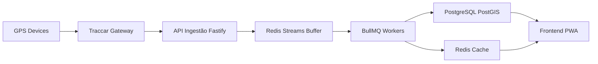

# 🛵 Moto-Sync Ultra-Resilient

Enterprise Fleet Management Platform

Moto-Sync é uma plataforma de monitoramento e gestão de frotas de alta performance, projetada para empresas de locação de motos.

A solução combina:

- rastreamento em tempo real
- automação financeira
- inteligência geográfica
- arquitetura resiliente orientada a eventos

Tudo isso com foco em baixo custo operacional (Free Tier Friendly) e alta escalabilidade.

## 🧠 Visão Geral

O Moto-Sync foi projetado para operar como uma plataforma de missão crítica, suportando falhas, picos de tráfego e crescimento contínuo.

Principais pilares:

- Arquitetura Event-Driven
- Processamento assíncrono
- Resiliência a falhas
- Baixo custo de infraestrutura
- Hardware agnóstico via Traccar

## 🏛️ Arquitetura do Sistema

A arquitetura é dividida em camadas desacopladas, permitindo escalabilidade horizontal e alta disponibilidade.

### 🗺️ Fluxo de Dados



### ⚙️ Camadas da Arquitetura

#### 📡 1. Edge / IoT

- Dispositivos GPS (ST310, TK103, Suntech)
- Comunicação via TCP/UDP
- Integração universal via Traccar

#### 🧱 2. Ingestão & Resiliência

Responsável por garantir que nenhum dado seja perdido.

- API de ingestão com Fastify
- Autenticação HMAC
- Rate limiting
- Buffer com Redis Streams

Protege contra:

- picos de tráfego
- falhas temporárias
- overload

#### 🧠 3. Processamento (Event-Driven)

Sistema baseado em filas com BullMQ.

Workers:

- **High Priority**
  - Geofencing
  - Safety Lock (bloqueio seguro)
- **Medium Priority**
  - Integração com Mercado Pago
  - Multas automáticas
- **Low Priority**
  - Histórico
  - Odômetro
  - Analytics

#### 🗄️ 4. Persistência

- **Redis**
  - Estado atual das motos (last position)
  - Cache de baixa latência
- **PostgreSQL + PostGIS**
  - Dados mestres
  - Histórico geográfico
  - Queries espaciais
- **Data Aging**
  - 0-30 dias -> dados completos
  - 30+ dias -> agregação
  - Longo prazo -> armazenamento frio

#### 📱 5. Interface (PWA)

Aplicação web moderna com:

- Next.js
- Tailwind CSS
- WebSockets (tempo real)

Recursos:

- mapa interativo
- clusterização de veículos
- interpolação de movimento
- dashboard financeiro
- controle remoto de dispositivos

## 🚀 Funcionalidades

### 🔐 Segurança e Controle

- Bloqueio remoto com validação de velocidade
- Assinatura HMAC em comandos
- Watchdog de dispositivos offline
- Monitoramento de bateria

### 💸 Gestão Financeira

- Integração com Mercado Pago
- Cobrança automatizada
- Sistema de multas configurável
- Webhooks de pagamento

### 📊 Inteligência de Frota

- Geofencing com PostGIS
- Histórico de rotas
- Odômetro virtual
- Alertas inteligentes

### 🔔 Comunicação

- Emails via Resend
- Push notifications via Firebase

### 🧩 Device Management

Gerenciamento completo de dispositivos:

- vinculo IMEI ↔ moto ↔ cliente
- status online/offline
- last_seen tracking
- inventário de hardware

### 🔁 Sistema de Comandos

Controle robusto com retry:

- PENDING -> SENT -> DELIVERED -> FAILED
- confirmação obrigatória
- retry automático
- auditoria completa

### 📊 Observabilidade

Monitoramento da saúde do sistema:

- eventos por minuto
- latência
- dispositivos online
- erros financeiros

### 🛡️ Segurança da Plataforma

- autenticação HMAC
- rate limiting
- validação de origem
- logs de auditoria

## 💰 Estratégia de Custos

Projeto otimizado para operar em Free Tier:

- Supabase (Postgres)
- Upstash (Redis)
- Vercel (Frontend)
- Render/Railway (Backend)

Mapas:

- padrão: OpenStreetMap
- uso premium sob demanda

## 📦 Stack Tecnológico

| Camada | Tecnologia | Função |
| --- | --- | --- |
| Gateway | Traccar | Integração com GPS |
| Backend | Node.js + Fastify | API de alta performance |
| Processamento | BullMQ + Redis | Filas e workers |
| Banco | PostgreSQL + PostGIS | Dados geográficos |
| Frontend | Next.js + Tailwind | PWA |
| Financeiro | Mercado Pago | Pagamentos |
| Comunicação | Resend + Firebase | Notificações |

## Ajustes Tecnológicos Recomendados

> Esta seção descreve evoluções recomendadas para robustez operacional.  
> Não representa mudança de stack e não altera as tecnologias atuais do projeto.

### Por Camada da Arquitetura

#### Edge / IoT

- Aplicar políticas de backpressure na borda para reduzir impacto de rajadas de telemetria.
- Definir SLA por criticidade de eventos já na entrada (alta, média, baixa prioridade).

#### Ingestão & Resiliência (Fastify + Redis Streams)

- Garantir proteção anti-replay em chamadas assinadas (nonce + timestamp + janela de validade).
- Reforçar segregação de credenciais por ambiente com rotação periódica de chaves HMAC.
- Consolidar idempotência de ingestão para prevenir duplicidade antes de entrar no processamento.

#### Processamento (BullMQ + Redis)

- Implementar retry por tipo de job com limites e backoff diferentes por criticidade.
- Adicionar Dead Letter Queue (DLQ) para eventos esgotados, com trilha de causa e reprocessamento controlado.
- Isolar workers por criticidade para preservar comandos de segurança e evitar starvation.

#### Comandos Críticos (bloqueio e ações remotas)

- Formalizar state machine de comando (`PENDING -> SENT -> DELIVERED -> FAILED -> EXPIRED`).
- Definir timeout operacional por tipo de comando e regras de compensação para estados inconsistentes.
- Manter auditoria de transição de estado com correlação por dispositivo, comando e operador.

#### Persistência e Dados (PostgreSQL + PostGIS)

- Evoluir estratégia de índices geoespaciais combinados com filtros temporais.
- Planejar particionamento por período/tenant para histórico de alta volumetria.
- Formalizar governança de dados (retenção, anonimização e trilha de auditoria/LGPD).

#### Integrações Externas (Mercado Pago, Resend, Firebase)

- Implementar circuit breaker para chamadas instáveis e fallback para envio/retentativa.
- Definir política de reentrega por integração com observação de limites de provedor.

#### Observabilidade e Operação

- Complementar métricas com tracing distribuído para identificar latência entre camadas.
- Padronizar correlação fim a fim (`requestId`, `eventId`, `deviceId`, `commandId`) nos logs.
- Definir degradação controlada sob pressão (fila, banco, API externa), preservando funcionalidades críticas.

### Mapa Tecnologia x Ajustes

| Tecnologia | Ajustes recomendados (sem trocar stack) |
| --- | --- |
| Traccar | Backpressure na entrada, classificação de prioridade, correlação por dispositivo |
| Fastify | Anti-replay (nonce/timestamp), idempotência de ingestão, controle de taxa por cliente |
| Redis Streams | Buffer resiliente com proteção contra burst e roteamento por criticidade |
| BullMQ + Redis | Retry por classe, DLQ, isolamento de workers e SLA por fila |
| PostgreSQL + PostGIS | Índices geoespaciais + tempo, particionamento, retenção e anonimização |
| Next.js + Tailwind | Exibir estados degradados de forma clara quando serviços críticos estiverem indisponíveis |
| Mercado Pago | Circuit breaker, retentativa com backoff e rastreio de falha por transação |
| Resend + Firebase | Fallback por canal, política de reentrega e monitoramento de entrega |
| Camada de Segurança (HMAC) | Rotação de chaves, segregação por ambiente e trilha de auditoria |

## 💻 Como Executar

### Pré-requisitos

- Docker + Docker Compose
- Node.js 18+

### 1. Subir infraestrutura

```bash
docker-compose up -d
```

Serviços iniciados:

- Traccar
- PostgreSQL
- Redis

### 2. Backend

```bash
cd backend
npm install
npm run dev
```

### 3. Frontend

```bash
cd frontend
npm install
npm run dev
```

## 🧪 Ambientes

- dev -> desenvolvimento local
- staging -> testes
- prod -> produção

## ⚙️ Configuração (Ambiente)

Antes de subir os serviços, configure as variáveis de ambiente do backend e frontend.

Sugestão de organização:

- `backend/.env`
- `frontend/.env.local`

> Observação: mantenha credenciais e chaves fora do versionamento.

## ✅ Qualidade e Validação

Comandos úteis para validação local:

```bash
# backend
cd backend
npm run lint
npm test
npm run build
```

```bash
# frontend
cd frontend
npm run lint
npm test
npm run build
```

## 🤝 Contribuição

Fluxo sugerido:

1. Crie uma branch de feature.
2. Faça commits pequenos e objetivos.
3. Execute lint/test/build localmente.
4. Abra PR com descrição do contexto e impacto.

## 📜 Licença

MIT License

## 👨‍💻 Autor

Lucas Carvalho  
Full Stack Developer & DevOps Enthusiast